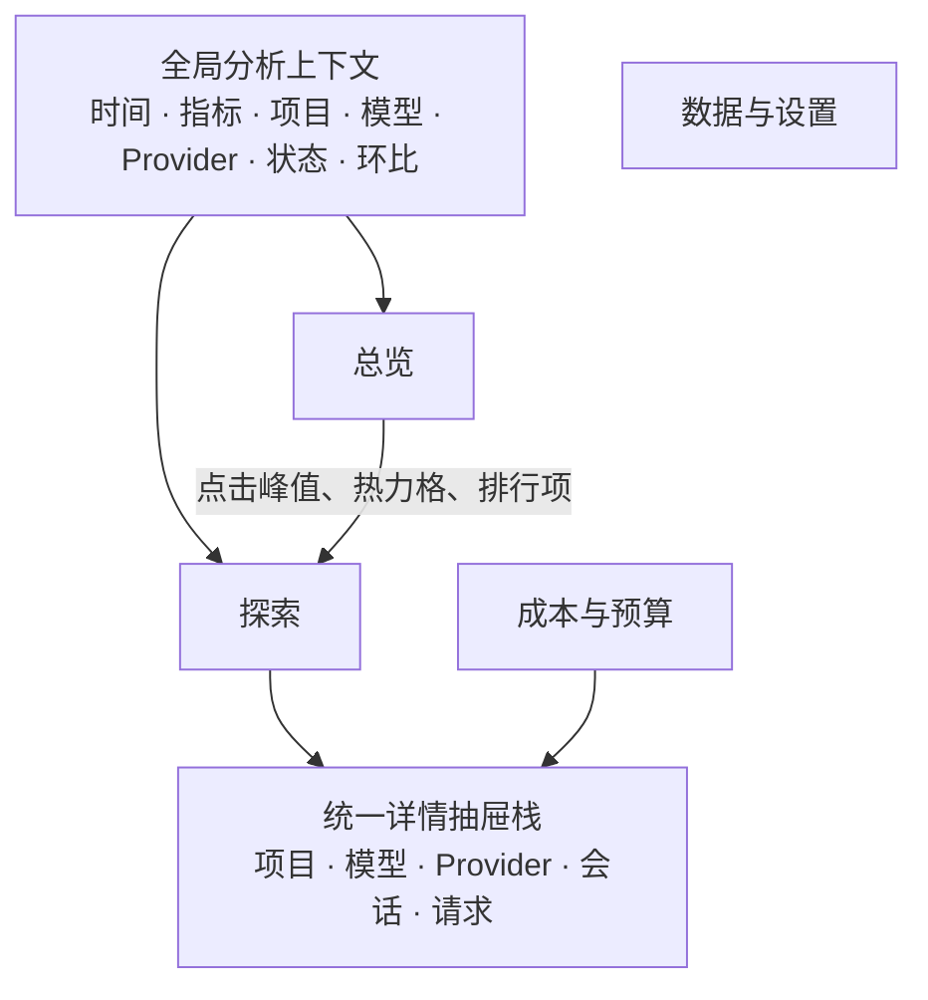
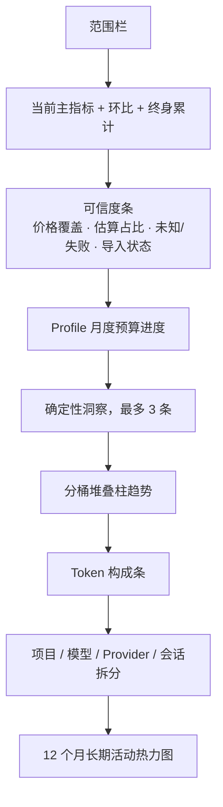

# dsh-token-usage v2 增强方案

## 1. 版本定位

v2 从“可查看本地用量总账的仪表盘”升级为“可连续调查、解释和控制用量的个人分析工作台”。

v2 的核心闭环是：


v2 以分析工作台为主体。预算只提供进度和超支风险，不执行通知或自动化告警。告警、账单对账、执行单元归因、跨 Profile 和团队云端能力进入 v3。

## 2. 已确认的产品原则

- 全局筛选、图表交叉筛选和详情抽屉是主要交互模型。
- 主分析范围默认最近 30 天，自动对比前一个等长周期；终身累计作为次级资料展示。
- 总览渐进披露，不默认堆叠大量图表和高级筛选。
- 自动洞察只使用确定性、可复现的统计规则，不调用 LLM，不读取对话正文。
- 所有分析继续遵守本地优先和内容隐私：不持久化或展示提示词、回答、工具参数和凭据。
- 使用量只代表活动，不生成“生产力指数”，不把 Token 多寡解释为生产力高低。
- 推理 Token 是 output 的子集，只单独标注，绝不重复计入总量。
- 费用默认使用当前规则重算；原始计价保留在详情和审计视图。
- Token 与费用主数字默认仅含 Provider 已上报值；“含估算”作为显式切换口径。

## 3. 信息架构

顶层从当前八个平级标签收敛为四个空间：

1. **总览**：发生了什么。
2. **探索**：为什么、谁造成的、具体到哪次请求。
3. **成本与预算**：费用如何计算、覆盖是否完整、预算进度和风险。
4. **数据与设置**：导入、导出、备份、保留、身份和显示设置。

项目、会话、请求、模型和 Provider 不再是五套互不连通的顶层页面，而是“探索”空间内可切换的分析对象。



## 4. 全局分析状态

所有分析模块共享一份筛选状态：

- 时间：今日、7 天、30 天、90 天、12 个月、全部、自定义范围。
- 主指标：处理 Token、新计算 Token、估算费用、请求数。
- 可信口径：仅已上报、含估算。
- 维度：项目、会话、模型、Provider。
- 请求状态：已上报、估算、失败、未知。
- 费用状态：已定价、价格未知。
- 对比：默认上一等长周期，可关闭。

同一维度中的多个值使用 OR；不同维度之间使用 AND。点击图表只会收窄范围，不会静默扩张范围。

筛选以可移除 chip 展示。恢复上次使用状态，并允许保存最多 8 个本地命名视图。普通导出必须继承当前筛选、估算口径和费用口径，并在下载前展示摘要。

## 5. 总览

### 5.1 布局



### 5.2 主要可视化

- **主趋势**：自动按小时、日、周或月分桶的堆叠柱，最多约 48 个桶。
- **Token 构成**：input、output、cache read、cache write 的横向构成条；reasoning 标注为 output 中的比例。
- **维度拆分**：排序横向条形图，展示主指标、次级指标、占比和环比。
- **长期热力图**：最近 12 个月，可切换 Token、费用、请求，支持点击某日形成筛选。
- 不使用 3D、仪表盘、词云或大量饼图。

时间桶、热力格、维度行和洞察卡都必须可点击并进入探索。

### 5.3 自动洞察

最多显示 3 条，按以下优先级选择：

1. 数据可信度与覆盖缺口。
2. 费用和预算风险。
3. 结构变化与环比异常。
4. 用量集中度和异常请求。
5. 活动习惯。

初始规则目录：

- 价格覆盖低于 95%。
- 估算占比显著。
- 失败率达到阈值或较上期显著上升。
- cache read 占比大幅变化。
- 单一项目、模型或 Provider 占比过高。
- 某模型份额显著变化。
- 请求量或 Token 超过稳健异常阈值。
- 存在价格未知模型、源已删除会话或导入错误。
- 连续活跃达到较长周期时，作为低优先级活动洞察。

每条洞察必须展示证据数字，并提供“查看相关数据”的筛选动作。阈值在 v2 固定并由测试保护，不增加用户阈值设置。

## 6. 探索空间

探索默认对象为会话，可切换：会话、项目、模型、Provider、请求和活动。

基本布局：

- 顶部沿用全局分析上下文。
- 中部显示当前对象的排序、构成和环比。
- 下部或左侧为游标分页、虚拟滚动列表。
- 右侧为可堆栈详情抽屉。

点击列表行只打开详情；点击“仅看此对象”才把对象加入全局筛选。

### 6.1 会话详情

会话使用中性标签：项目名、开始时间、请求数和短 ID。不读取或保存由对话内容生成的标题。

详情包含：

- 直接 owned 用量。
- 含子会话用量。
- fork 继承上下文用量，明确不重复计费。
- 自然时间跨度和按 30 分钟闲置截断的活跃时长。
- 模型切换和 step 时间线。
- 父会话、子会话和 subagent 树。
- 请求列表和请求状态。
- 源会话是否已删除。

### 6.2 项目详情

项目从 cwd 字符串升级为可治理实体：

- 优先使用 Git remote/root 形成稳定身份，回退到规范化 cwd。
- 支持合并、拆分、重命名、颜色和隐藏。
- 所有人工变更只影响派生视图，不改写请求原始事实。
- 列表默认显示项目名；完整本地路径只在详情按需展示。
- 普通导出继续匿名化路径和 remote。

项目详情展示趋势、模型构成、Provider 构成、预算、主要会话和异常请求。

### 6.3 模型与 Provider 详情

模型详情展示：

- 原始模型名和 canonical alias。
- 匹配价格模型、价格来源和覆盖状态。
- input/output/cache 构成。
- 所使用的 Provider 和主要项目。
- 当前规则费用和原始费用审计入口。

Provider 详情展示：

- Provider 倍率。
- 模型构成。
- Token、费用、请求和状态趋势。
- 相关预算和价格覆盖。

### 6.4 请求详情

不展示任何对话内容。字段包括：

- 时间、会话、turn、step、项目。
- Provider、原始模型、canonical 模型。
- input、output、cache read、cache write、reasoning。
- 处理 Token、新计算 Token。
- Provider 已上报或估算状态、估算器版本。
- 原始计价、当前规则计价、匹配价格模型和价格版本。
- 持续时间、结束原因和结构化失败类型；无法可靠取得时显示未知。
- owned、fork inherited、subagent 谱系说明。
- 进入会话、仅看此项目/模型/Provider 的动作。

## 7. 活动分析

活动分析不生成生产力评分，包含：

- 12 个月日历热力图。
- 星期 × 小时活动矩阵。
- 会话自然跨度和活跃时长分布。
- 活跃日、活跃时段、会话数量和项目投入。

界面文案使用“活动”“使用节奏”“会话结构”，不使用“效率高低”或“生产力排名”。

## 8. 数据修正与审计

v2 支持对异常请求追加：

- Token 修正值。
- 排除聚合标记。
- 本地备注。
- 撤销记录。

原始请求事实不可变。默认聚合使用当前有效修正，详情中同时显示原始值、修正值、时间和审计记录。

## 9. 成本与预算

### 9.1 费用

- 分析默认使用当前 alias、价格目录和 Provider 倍率重算。
- 原始计价保留且不可变。
- 未匹配模型贡献 Token 和请求，不贡献费用。
- 费用总数始终展示价格覆盖率。
- 价格覆盖不足时，费用明确标为“已覆盖部分的下限”。
- 用户价格输入以 USD / 1M Token 等可读单位展示，不以 nano-USD 或基点作为主要交互单位。

### 9.2 预算

统一预算模型支持：

- 范围：Profile、项目、Provider、模型。
- 单位：USD、处理 Token、新计算 Token。
- 周期：自然月。
- 生命周期：生效、归档、复制到下月。

多个范围预算彼此独立评估，不相互分摊或扣减。

预算风险规则：

- 月初至今线性外推：已消耗 / 已过天数 × 当月天数。
- 至少存在 3 个活跃日或 20 个请求后才给预测。
- USD 预算只有价格覆盖率达到 95% 才展示月底费用预测。
- 覆盖不足时继续展示已定价费用下限、预算进度和缺口说明。
- Token 预算不受价格覆盖率限制。

总览展示 Profile 预算条；项目、模型和 Provider 预算只在相应实体抽屉和成本空间展示。

v2 不发送应用外通知、系统通知或 Webhook，也不执行自动阻断。

## 10. 数据与存储增强

v2 增加并历史回填：

- 请求持续时间。
- 结束原因和结构化失败类型。
- 稳定项目身份及人工映射。
- 追加式修正记录。
- 月度预算及归档记录。
- 查询 revision 和必要的聚合索引。

只从可靠日志事实回填；缺失字段保持未知，不推测隐藏重试或上游费用。

## 11. 分析查询模块

现有读取面按页面暴露多个浅方法，v2 收敛为一个深分析模块，外部接口仅保留三个入口：

```text
constrain(filter, patch) -> Filter
query(spec) -> QueryResult
inspect(ref) -> EntityReport | null
```

- `constrain` 负责时区正确的点击筛选代数。
- `query` 一次返回所需 KPI、趋势、构成、拆分、洞察、预算和游标页。
- `inspect` 负责项目、模型、Provider、会话和请求详情；fork inherited 和 including children 只在详情中作为一级语义出现。

RPC 只作为薄适配器，不重复聚合。筛选、时区、ownership、估算口径、费用覆盖、环比、洞察、游标和缓存都隐藏在模块实现中。

同一 revision 和规范化查询必须产生稳定结果。写入请求、导入、alias、价格、倍率、修正、预算、清理或恢复后递增 revision 并使缓存失效。

## 12. 加载、错误与实时更新

- 每个模块独立加载、失败和重试，不因一处失败清空全页。
- 首次加载使用匹配最终布局的 skeleton。
- 筛选变化采用 stale-while-revalidate：保留上一帧并局部变暗，不闪成空白。
- 页面聚焦时每 15 秒静默刷新，并提供手动刷新。
- 页面失焦或 overlay 关闭后停止轮询。
- 导入状态、价格覆盖、估算比例和源删除属于数据可信度，不伪装成普通错误。
- 账本不可用时，明确说明 Harness 本身仍可继续使用。

## 13. 响应式与无障碍

必须验收：

- Harness 深色和浅色主题变量。
- 中文和英文。
- 键盘操作和清晰焦点。
- Esc 先回退详情抽屉栈，栈空后关闭 overlay。
- 关闭后焦点返回侧栏用量入口。
- 宽屏右侧固定抽屉；中等宽度覆盖式侧板；900px 以下单栏全高详情。
- 图表提供键盘可聚焦数据点和文本等价信息。
- 独立空状态、过滤后无结果、部分数据和错误状态。

## 14. 性能契约

目标规模：10 万请求、1 万会话。

- 常用 30 天 KPI + 趋势 +拆分查询 p95 不高于 100ms。
- 全部时间 KPI 和 12 个月热力图不进行逐行 JS 全表聚合或逐日 SQL 循环。
- 一次主分析查询使用一个 RPC。
- 列表使用游标，不使用 offset；请求页单次上限 200，客户端虚拟滚动。
- 图表最多发送约 48 个趋势桶、20 个拆分项和必要的“其他”汇总。
- 查询内存工作集保持有界，不向客户端发送全部请求。

## 15. v2 交付路径

### 原型门槛

实现前先用合成数据创建可交互原型，验证：

- 四空间导航。
- 全局筛选和 chip。
- 趋势点击/框选。
- 维度下钻。
- 详情抽屉栈。
- 自动环比。
- 宽屏、中屏和 900px 以下布局。

原型不得连接或修改真实账本。

原型已在独立 `prototype/v2-workbench` 分支的 `2b38793` 提交中留档。用户确认生产版采用混合方案：

- 总览采用 A 的分带式分析结构。
- 探索采用 B 的三栏调查工作台。
- 确定性洞察采用 C 的证据式表达，但压缩为最多三条，不把整页改为叙事流。

### 四个内部里程碑

1. **分析底座**：schema 迁移、项目身份、请求元数据回填、统一 Filter、query/inspect、游标、revision、性能基准。
2. **分析工作台**：总览、探索、趋势、构成、拆分、热力图、详情抽屉、保存视图、筛选一致导出。
3. **可信分析与控制**：确定性洞察、修正审计、成本解释、预算进度和风险。
4. **硬化验收**：10 万请求基准、历史迁移、真实 GUI、主题、locale、键盘、响应式、Console、网络和 Lighthouse。

四个里程碑全部通过后再发布 v2，不拆成多个公开半成品版本。

### 实现与验收记录（2026-08-29）

- 统一深层接口已落在 `lib/ledger/analytics.js`：`constrain(filter, patch)`、`query(spec)`、`inspect(ref)`；host RPC 仅做薄适配。
- schema v3、稳定项目身份、Git/worktree 识别、请求元数据、追加式修正/撤销、自然月预算、持久 revision 与按 revision 物化/缓存已完成。
- 生产 UI 已采用确认的 A 总览 + B 探索 + C 证据式洞察，保留四空间、全局 scope、详情栈、保存视图和筛选一致导出；原型切换器未进入生产 bundle。
- `npm run check` 通过 64 项测试；`npm pack --dry-run` 与 `git diff --check` 通过。代码审查发现的项目路径导出泄漏、恢复竞态、时区边界、修正审计、历史恢复和有界载荷问题已修复并补回归测试。
- 10 万请求 / 1 万会话基准：交互筛选 p95 6.85ms，缓存 p95 0ms，满足 100ms 目标；首次构建 revision 物化表约 868ms，仅在冷启动或 ledger revision 变化后发生一次。
- 已在现有 `http://127.0.0.1:3080` 验证总览收窄、探索会话→请求详情栈与 Esc 回退、成本/预算、可搜索定价、项目治理，以及 1440/1000/390px、明暗主题。Token Usage RPC 均为 200，Console 无 error/warn；Lighthouse snapshot 为 Accessibility 93、Best Practices 100，剩余失败主要来自 DSH shell，会话侧栏摘要的可访问名称已在插件源码修正；性能 trace CLS 为 0.00。

## 16. v2 明确不包含

- LLM 自动总结或读取对话正文。
- 生产力评分。
- 系统通知、Webhook、告警恢复、静默期和自动阻断。
- Provider 账单导入、额度同步和实际支付对账。
- Agent、Skill、Tool 归因。
- 跨 Profile 汇总。
- 团队仪表盘、云同步和分享链接。
- 自定义预算账期或滚动预算。
- 任意双时间段对比。
- 百万级或分布式分析。
- URL Router。

## 17. v3 路线

v3 预留以下方向，但需分别重新确认安全、权限、数据来源和发布边界：

1. 预算告警与自动化：应用内/系统通知、Webhook、静默期、恢复通知、告警历史和可选执行动作。
2. 账单、额度与实际费用对账：Provider 账单或订阅额度导入，区分估算费用、账单金额和实际支付。
3. Agent / Skill / Tool 归因：只有 Harness 提供可靠事件后才实现，不从文本猜测。
4. 跨 Profile 本地汇总：保持本机处理，不默认上传。
5. 团队与云端能力：共享仪表盘、云同步和团队预算；它会改变当前本地优先边界，必须采用显式 opt-in，并进行独立的身份、权限、加密、删除和数据驻留设计。

## 18. 最终验收闭环

用户应能在三次主要交互内完成：

1. 在总览看到一个峰值、成本变化或洞察。
2. 点击形成筛选并定位到造成变化的项目、模型、Provider 或会话。
3. 打开具体请求，解释 Token 构成、计价、可信度和会话谱系。

如果只能看到更多图，却不能完成这一闭环，则 v2 不算完成。
