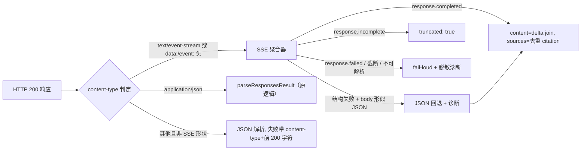

# 搜索后端流式修复 — 交付报告（dsh-token-usage 5.2.1）

任务：修复 token-usage 的 chatgpt 搜索后端请求形状（上游 chatgpt.com codex 端点演化），使搜索链真实成功。
工作树：`~/.dsh/plugin-lab/environments/dev/workspace/dsh-017-dsh-token-usage`（分支 `dsh-017-migration`，继承 WIP 保留，未 stage/commit）。
日期：2026-09-23。执行者：搜索后端修复实施代理（delegated）。

## 1. 上游根因（主线程 curl 对照实验结论，本任务输入）

`POST https://chatgpt.com/backend-api/codex/responses`：

| 请求形状 | 结果 |
| --- | --- |
| `stream: false` | 400 `{"detail":"Stream must be set to true"}` |
| `max_output_tokens: 4096` | 400 `{"detail":"Unsupported parameter: max_output_tokens"}` |
| `{model:'gpt-5.6-sol', store:false, stream:true, instructions, input, tools:[{type:'web_search'}], tool_choice:'auto'}`（无 max_output_tokens） | 200 SSE 流：208 个 data 事件，含 `response.output_text.delta`×183、`web_search_call`×4、`url_citation`×9、`response.completed` |

一手 SSE 样本（`/tmp/r5.sse`，无凭据）关键事实：`event:`+`data:` 行框、**无 `[DONE]` 行**、终端 `response.completed` 的 `response.output` 为**空数组**（文本只能从 delta 聚合）、`url_citation` 经 `response.output_text.annotation.added` 事件携带。

## 2. diff 摘要

仅动 `lib/accounts/search-backends.js`（+测试/版本文件）：

1. **codex 腿请求形状**（`provider === 'openai-codex'`）：`stream: false` → `stream: true`；移除 `max_output_tokens`；`accept` 改为 `text/event-stream, application/json`。其余字段（model/store/instructions/input/tools/tool_choice）不变。
2. **响应读取重构**：`await response.json()` → `readResponsesPayload()`，content-type 自适应：
   - `text/event-stream`（或未知 content-type 但 body 以 `event:`/`data:` 开头）→ SSE 聚合器；
   - `application/json` → 原非流式读取（`parseResponsesResult` 不变，仍是导出契约）；
   - SSE 解析结构失败（malformed data 行 / 缺失 string type / 无终止事件）且 body 形似 JSON → 回退 JSON 解析（诊断注明 `SSE parse failed (…), JSON fallback applied`）；
   - 不可解析（如 HTML 网关错误）→ fail-loud，诊断含 content-type + body 前 200 字符（`Bearer …`/`sk-…` 打码），不伪造成功。
3. **SSE 聚合器**（`parseSseResponses`，导出以便单测）：逐行解析、多行 `data:` 以 `\n` 连接、空 data 与 `[DONE]` 跳过、CRLF 兼容；`response.output_text.delta` 按序 join 为 `content`；`annotation.added` 与 message `output_item.done` 的 `annotations` 去重收集为 `sources`（**不**收 `output_item.done` 的正文，避免与 delta 双计）；终止事件裁决：`response.completed` → `truncated: false`、`response.incomplete` → `truncated: true`（诚实标注）、`response.failed` → 抛错（含脱敏 error 详情）、**流截断无终止事件** → 抛错并附观察到的事件类型统计。
4. **返回形状**：与现有消费方（宿主 searchChain 的 leg 契约）完全兼容——`{ content?: string, sources: [{url, title?}], truncated: boolean }`（`sources` 数组必在；对照 `dsh-017-dsh-subscription-search/lib/search-chain.js` 的 `validateResult`/`isEmpty` 核验）。
5. **abort 传播**：读 body 时的中断不再被包装成 INVALID_RESPONSE，`signal.reason` 原样抛出。

`lib/index.js`、调用方、错误码集合（`SEARCH_BACKEND_*`）均未改动。

## 3. grok（xai）分支决策：保留原请求形状

**决策**：grok 腿不改请求（保留 `stream: false` 语义的默认非流式 body + `max_output_tokens: 4096`），但**共享**新的 content-type 自适应读取器。

**理由**：
1. 强制 `stream: true`、拒绝 `max_output_tokens` 的约束只在 chatgpt.com 的**内部演化端点**上验证过；`api.x.ai/v1` 是公开文档化 API，非流式响应与 `max_output_tokens` 均是其正式支持的行为，没有上游演化证据，不可外推。
2. test017 无 grok 登录，无法实测；在零证据下把一个可能正常工作的分支改成流式是纯风险、无收益（坏分支的 fallback 链会退化到更弱的腿）。
3. 读取器统一后，若 xai 端点将来自行返回 SSE（content-type 判定），同一路径即可聚合，无需再改请求。
4. 代码注释与 CHANGELOG 均已标注「xai 端点行为未实测（测试环境无 Grok 登录）」。

风险声明：grok 腿当前真实连通性**未验证**（无从登录）；若主线程后续在真实环境发现 xai 也强制流式，仅需把该腿切到 `streaming` 分支（一行布尔）即可。

## 4. SSE 聚合设计

设计要点：
- body 一次性读入（搜索响应 72KB 量级，聚合器不需要增量背压），使 content-type 谎报时的回退可靠。
- 诊断脱敏：只取前 200 字符，`Bearer <token>` 与 `sk-<token>` 模式打码；凭据（OAuth token）从不进入 body 或诊断。
- 终止事件是唯一成功凭据：没有 `response.completed/incomplete/failed` 之一就不返回结果（不把半截流当成功）。

## 5. 测试结果

- `test/search-backends.test.js` 重写 mock（旧 mock 的 `response.json()` 形状已 stale），17 项全绿：
  - codex 腿请求形状断言（stream:true、无 max_output_tokens、accept、store:false、tools）+ SSE 聚合结果（content 来自 delta 有序 join、annotation url_citation 去重、无 token 泄漏）；
  - grok 腿保留形状断言（max_output_tokens:4096、accept:application/json）+ JSON 解析；
  - 边界：JSON-尽管-stream:true 回退、SSE content-type 装 JSON body 回退、`[DONE]`+多行 data、CRLF+注解去重、`output_item.done` 注解收集不双计文本、incomplete → truncated:true、截断流 fail-loud（含事件统计）、response.failed fail-loud、HTML body fail-loud（含 content-type）、诊断脱敏（Bearer/sk- 打码）、malformed+JSON 回退、HTTP 400 专用错误码。
  - fixture 为 /tmp/r5.sse 真实事件形状的合成样本（id 全部 fixture 化，无凭据、无 encrypted_content）。
- 全量门禁：`npm test` → **405 项，398 pass / 0 fail / 7 skipped（既有 skip）**；`npm run check`（lib 全量 `node --check` + bin + 全量测试）同绿。无独立 build 步骤（纯 ESM lib，无 bundle 产物）。

## 6. 候选记录

| 项 | 值 |
| --- | --- |
| 候选 id | `5b5ff7f6-56f0-41c3-a203-c074ebdef64a` |
| 包 | `~/.dsh/plugin-lab/artifacts/5b5ff7f6-56f0-41c3-a203-c074ebdef64a/dsh-token-usage-5.2.1.tgz` |
| sha256（tgz） | `a94928b7bc25516e3ac88719131adb7ba91a7935632aac6dc76dc47e995c6679` |
| sourceSha256（源码树指纹，不含 .git/node_modules） | `08ca0b6eb434801fa3081aa7a6a2b3cb97b5c5a2df27ace4d5d5de3f8b117161` |
| 版本 | 5.2.0 → 5.2.1（package.json / README.md / README.zh.md 标题同步） |
| tgz 内容抽查 | `lib/accounts/search-backends.js` 含 stream:true 与 parseSseResponses；package.json version=5.2.1 ✓ |

变更文件：`lib/accounts/search-backends.js`、`test/search-backends.test.js`、`package.json`、`CHANGELOG.md`、`README.md`、`README.zh.md`、本报告。未 stage/commit，WIP 全部保留。

## 7. 边界遵守与未验证项

- **未做**（按边界）：未装 test017、未重启任何实例、未复现端到端搜索、未触碰 dev017/生产/3080、未读任何凭据（测试全用 mock SSE/JSON 样本）。
- **剩余风险 / 待验证**（移交主线程）：
  1. 真实 chatgpt.com codex 端到端复现（用本候选装 test017 后跑搜索链）——本任务的 mock 形状与主线程 curl 实验一致，但真实链路未由本 agent 运行；
  2. grok/xai 腿端点行为未实测（无登录）；
  3. `url_citation` 在其他事件通道（如未来事件形状变化）的覆盖是按当前观察实现的前向兼容；未识别事件类型按跳过处理（已见于 web_search_call.in_progress/searching 等事件）。